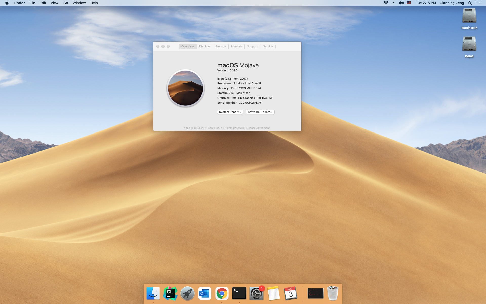

# OpenCore v0.6.3 Hackintosh MacOS Mojave for Intel Core i5-7500 and Gigabyte H110M-h motherboard

This repository provides two versions of EFI, Verbose and Release, for printing out verbose message on booting or not. Please use the specified version accordingly. Both versions work for MacOS Catalina as well. But, AR9360 WLAN Card is not working on MacOS Catalina platform easily. With this EFI, all components are working well, e.g., RTL8111 ethenet LAN, high-quality audio, AR9360 WIFI card, Kingston 240GB SSD, WD 1T HDD, iGPU acceleration, USB hub-based keyword and mouse wakeup after sleep, etc.

### General BIOS Setup Before Installation

Please disable or enable following items if you see them in your motherboard BIOS setting.
- Disabled:
  - 'Fast Boot'
  - 'CFG Lock'
  - 'VT-d'
  - 'CSM'
  - 'Intel SGX'
- Enabled:
  - 'VT-x'
  - 'Above 4G decoding'
  - 'Hyper Threading'
  - 'Execute Disable Bit'
  - 'EHCI/XHCI Hand-Off'
  - 'OS type: Windows 8/10'
  - 'Legacy RTC Device'
  - 'Internal Graphics'
  - 'DVMT Pre-allocated: 64M'
  - 'DVMT Total Gfx Mem: 256M'

### GenSMBIOS

Please replace MLB, SystemProductName, SystemSeriesNumber, and SystemUUID with your numbers generated by [GenSMBIOS](https://github.com/corpnewt/GenSMBIOS).

### Results

